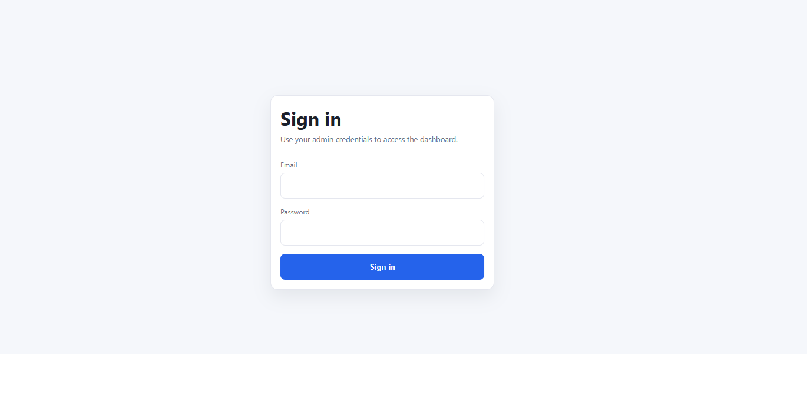
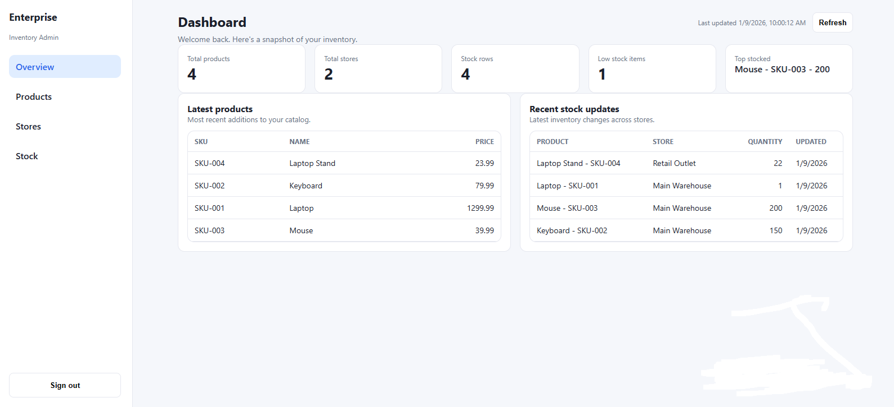
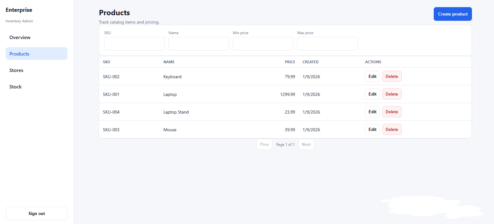
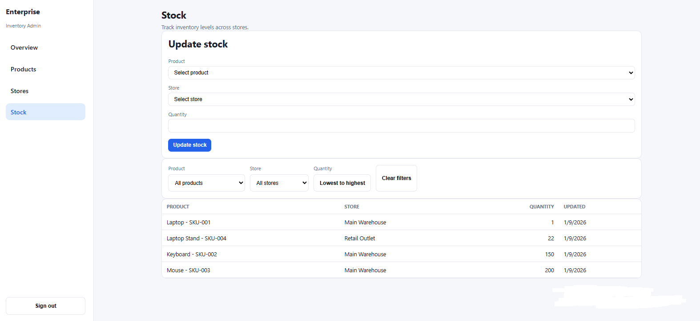

# Enterprise Inventory Frontend

Enterprise-grade inventory management dashboard built with **Next.js & React**, designed to work with a secure **ASP.NET Core Web API** backend.

This frontend application focuses on usability, clean UI architecture, and responsive design, following real-world enterprise application patterns.

---

## Backend API

The backend API for this project is implemented with **ASP.NET Core (.NET 8)** and is available here:

👉 https://github.com/serlefko-cmyk/enterprise-inventory-api

---

## 🚀 Tech Stack

- **Next.js (React)**
- **TypeScript**
- **JWT Authentication**
- **REST API integration**
- **Responsive / Mobile-first UI**

---

## ✨ Features

- Secure authentication using JWT
- Inventory and stock management UI
- Dashboard-driven interface for business data
- Clean and maintainable component structure
- Fully responsive design (desktop & mobile)
- Clear separation between UI and backend API logic

---

## 📸 Screenshots

### Login


### Dashboard


### Products Management


### Stock per Store


---

## ⚙️ Getting Started

### Install dependencies
```bash
npm install
```

---

### Environment Variables

Create a `.env.local` file:

```env
NEXT_PUBLIC_API_BASE_URL=http://localhost:8080
```

---

### Run the development server
```bash
npm run dev
```

Application will be available at:
```
http://localhost:3000
```

---

## 🖥️ Application Overview

The frontend provides a modern dashboard interface for interacting with the Enterprise Inventory API, including:

- Authentication and authorization flows
- Product and store management
- Stock visibility per store and product
- Business-oriented dashboard views

---

## 🏗️ Purpose

This project was built as a **portfolio-grade enterprise frontend**, demonstrating:

- Professional React & Next.js application structure
- Secure frontend authentication handling
- Integration with a real-world enterprise backend API
- Scalable and maintainable UI architecture
- Responsive, business-focused user experience

It is intended for technical evaluation, interviews, and enterprise-level code review.

---

## 📄 License

This project is licensed under the **MIT License**.
